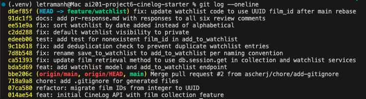

## Comment 1 — Rename
**What I did:** Renamed `save_to_watchlist()` to `add_to_watchlist()` in 
services/watchlist_service.py to match the project's verb_to_noun convention 
used by add_to_collection(). Updated the one call site in 
routes/watchlist/watchlist.py (both the import statement and the function call 
inside add_film()).
**How I verified:** Ran `grep -rn "save_to_watchlist" --include="*.py" .` to 
confirm no references remained, then ran the full test suite (pytest tests/ -v) 
to confirm nothing else broke.

## Comment 2 — Deduplication
**What I did:** Added a check in `add_to_watchlist()` that queries for an 
existing WatchlistEntry matching the user_id and film_id before creating 
a new one. If found, raises a new `AlreadyInWatchlistError`, mirroring the 
AlreadyInCollectionError pattern in collection_service.py.
**How I verified:** Ran the existing test suite to confirm no regressions. 
[Once you write a test for this in the stretch goal, or manually test with 
curl, mention that too.]

## Comment 3 - Watchlist test
**What I did:** Created `tests/test_watchlist.py` and mirrored test_add_to_collection_nonexistent_film_raises from `test_collection.py`, adapting it to call `add_to_watchlist`. 
I used a fake integer ID (999999) rather than a UUID, since Film.id is still db.Integer at this point in the branch — before the Comment 6 rebase migrates it to UUID. 
**How I verified:** Ran `pytest tests/test_watchlist.py -v` to confirm the new test passed in isolation, then `pytest tests/ -v` to confirm all tests (including the existing collection tests) still passed.

## Comment 4 — Default visibility
**My position:** Change the default to public=False.
**Reasoning:** I agree that the default should be an intentional design decision rather than an inherited value. I recommend changing the default visibility for watchlists to public=False because a watchlist represents a user's future viewing interests, which can be more personal than content they've already watched. This also aligns with CineLog's design, where CollectionEntry does not have a visibility field, suggesting that watchlists were intentionally given separate privacy controls. The tradeoff is that public discovery is reduced by default, but the cost of unintentionally exposing a user's planned viewing is greater than requiring them to explicitly make a watchlist public. Since the current implementation does not provide a way to set public=True through the endpoint, a follow-up improvement would be to add that option so users can intentionally share their watchlists.
**Tradeoff acknowledged:** Reduced public discoverability by default, 
in exchange for avoiding unintentional exposure of personal viewing interests.

## Comment 5 — Sort order
**My position:** Change default sort to date_added DESC.
**Reasoning:** I agree with changing the default sort order to date_added DESC. This is already the behavior used by get_collection(), so keeping watchlists consistent with the rest of CineLog makes the application more predictable. I also think recency better reflects how users interact with a watchlist: newly added films are often the ones they're most interested in watching next, whereas alphabetical order is more useful for searching within large lists. The tradeoff is that alphabetical ordering can make it easier to locate a specific title, but I think recency is the better default behavior, with alphabetical sorting being a good candidate for a future optional sort mode.
**Engagement with reviewer's point:** Agreed with their recency argument and 
reinforced it with the existing get_collection() precedent for consistency 
across the app; acknowledged alphabetical has its own value for large lists 
and proposed it as a future optional sort mode rather than dropping it.

## Comment 6 — Merge Conflict Resolution
**What I did:** Resolved the rebase conflict in models.py where Git flagged the missing WatchlistEntry class as a conflict because it did not exist on main. Kept the WatchlistEntry class from my branch and updated the film_id field from db.Integer to db.String(36) to match the project's UUID-based film ID schema. After resolving the model conflict, I searched for and fixed remaining integer-based film ID references in the service docstring, route docstring, and test file to keep the implementation and documentation consistent.
**How I verified:** Ran the full test suite (pytest tests/ -v) after the rebase and after each fix to confirm the changes did not introduce regressions. All tests passed successfully (5/5).

